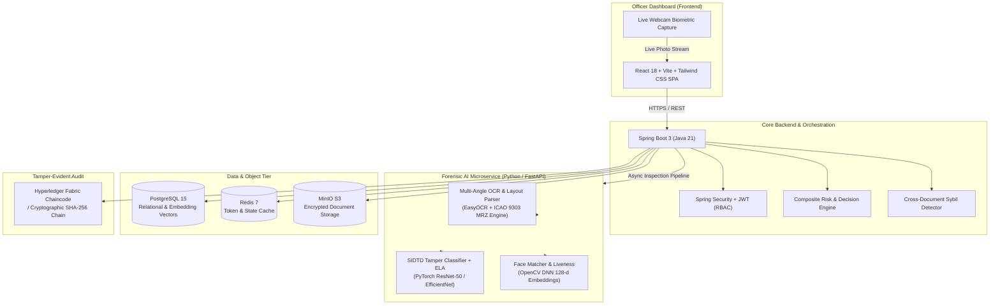

# 🛡️ SIH26188 — AI-Based Fake Identity & Document Screening System

**Ministry of Home Affairs (MHA) | SSB, Police II Division**  
*National Level AI-Driven Automated Border Control, Law Enforcement & Document Verification Solution*

[](https://python.org)
[](https://pytorch.org)
[](https://fastapi.tiangolo.com)
[](https://openjdk.org)
[](https://spring.io/projects/spring-boot)
[](https://react.dev)
[](https://www.postgresql.org)
[](https://www.docker.com)

---

## 📌 Executive Summary

Modern border security checkpoints, immigration terminals, and law enforcement agencies face an increasing volume of sophisticated identity fraud—including photo substitutions, digital text manipulations, counterfeit stamps, and synthetic biometric impersonation.

**SIH26188** is an enterprise-grade, zero-trust screening system designed for real-time forensic inspection of national IDs and international passports. The platform integrates:
1. **Deep Learning Document Tampering Detection:** Trained on the **SIDTD** (Synthetic & Real Identity Document Tampering Dataset) benchmark using deep convolutional neural networks (PyTorch ResNet-50 / EfficientNet).
2. **Multi-Angle Layout-Aware OCR:** Powered by EasyOCR with dynamic auto-orientation detection ($0^\circ, 90^\circ, 270^\circ, 180^\circ$) to effortlessly read smartphone captures, scans, and physical cards.
3. **Biometric Face Verification & Live Webcam Capture:** Deep 128-dimensional facial embedding cosine matching, active/passive liveness validation, and an interactive real-time webcam module in the officer UI.
4. **Cross-Document Sybil / Multi-Identity Fraud Tracking:** Facial embedding clustering across the database to detect fraudsters operating under multiple aliases or serial numbers.
5. **Deterministic Validation & Watchlist Screening:** ICAO 9303 TD3 checkdigit verification, expiry audit, and fuzzy blacklist matching against national security databases.
6. **Immutable Audit Ledger:** Cryptographic SHA-256 chain-of-custody logging with Hyperledger Fabric chaincode integration and resilient in-memory fallback.

---

## 🏛️ System Architecture



---

## 🚀 Core Features & Technical Highlights

### 1. Trained SIDTD Tampering Detection Model
- **Deep Architecture:** Utilizes a transfer-learned ResNet-50 / EfficientNet deep neural network trained directly on authentic and forged documents from the [SIDTD benchmark](https://github.com/Oriolrt/SIDTD_Dataset).
- **Inference Pipeline:** Preprocesses document tensors to $224 \times 224$ (ImageNet normalized) and performs real-time forward passes (`torch.no_grad()`) computing softmax probability distributions over authentic vs. tampered classes.
- **Error Level Analysis (ELA):** Detects localized re-compression artifacts, measuring Hot Pixel Fraction and standard deviation spread.
- **Font & Glyph Variance:** Analyzes typography height distributions to detect digital font insertions and forged textual overlays.
- **Weights Location:** Production weights loaded from `ai-service/models/best_model.pt`.

### 2. Multi-Angle Layout-Aware OCR Engine
- **Automatic Multi-Angle Orientation Detection:** Smartphone photos and scanner uploads are frequently rotated. The engine computes an initial readability coherence score at $0^\circ$. If readability is below threshold, it evaluates $90^\circ$, $270^\circ$, and $180^\circ$ and rotates the image to the angle yielding maximum readability.
- **Multi-Document Support:**
  - **Passports:** Full ICAO 9303 TD3 Machine Readable Zone (MRZ) parser with strict checkdigit arithmetic.
  - **Indian Driving Licences:** Regex & layout parsers extract DL Number (e.g. `MH10 20240021135`), Holder Name, DOB, Issue Date, and Validity.
  - **National IDs:** Aadhaar (`\d{4}\s\d{4}\s\d{4}`), PAN (`[A-Z]{5}\d{4}[A-Z]`), and Voter IDs.
- **Graceful Field Policy:** When information is present on the document, it is extracted into its respective field; if absent, the interface displays an elegant `—` indicator.

### 3. Biometric Face Verification & Live Webcam Capture
- **Portrait Extraction:** Automatically detects and crops the identity photo from the document.
- **Live Biometric Capture:** The frontend officer dashboard includes a live `<video>` feed with a biometric target reticle, snapshot button (converting canvas to image file), and retake controls.
- **Deep Similarity:** Extracts 128-dimensional facial embedding vectors using OpenCV DNN and calculates cosine distance ($D_{\text{cosine}} \ge 0.60 \implies \text{Match}$).
- **Liveness Analysis:** Laplacian blur detection and facial symmetry checks prevent printed photo / screen playback spoofs.

### 4. Cross-Document Identity / Sybil Fraud Detection
- Every verified face embedding is stored in the database.
- When a new document is presented, the system checks whether the applicant's face matches existing records under a **different** document number. If an identity mismatch is found, it triggers a critical fraud alert (+10.0 risk penalty).

### 5. Deterministic Rules & Watchlist Screening
- **MRZ Checkdigits:** Validates composite checkdigit, document number checkdigit, DOB checkdigit, and expiry checkdigit.
- **Cross-Zone Reconciliation:** Compares text extracted from the Visual Inspection Zone (VIZ) with the MRZ.
- **Expiry Check:** Evaluates document validity against current timestamp.
- **Blacklist Screening:** Instant fuzzy and exact matching against law enforcement watchlists (e.g. INTERPOL, MHA High-Risk Lists).

### 6. Composite Risk Engine & Decision Matrix
Calculates a final weighted risk score from 0 to 100 with actionable verdicts:
- **`0 – 24` (LOW):** Recommendation: `CLEAR`
- **`25 – 64` (MEDIUM):** Recommendation: `MANUAL_REVIEW`
- **`65 – 100` (HIGH / CRITICAL):** Recommendation: `REJECT`

---

## 📂 Repository Structure

```
SIH26188/
├── ai-service/                         # Python AI Microservice (FastAPI + PyTorch)
│   ├── app/
│   │   ├── main.py                     # FastAPI entrypoint & router mounts
│   │   ├── config.py                   # Environment configuration & model flags
│   │   ├── models/
│   │   │   └── best_model.pt           # Trained SIDTD PyTorch model weights
│   │   ├── routers/
│   │   │   ├── tamper.py               # /tamper/analyze router
│   │   │   ├── ocr.py                  # /ocr/extract router
│   │   │   └── face.py                 # /face/verify router
│   │   └── services/
│   │       ├── tampering_detector.py   # ResNet/EfficientNet + ELA engine
│   │       ├── ocr_engine.py           # EasyOCR + auto-orientation + VIZ parser
│   │       ├── mrz.py                  # ICAO 9303 TD3 checkdigit engine
│   │       └── face_verifier.py        # Facial landmark detection & embedding
│   ├── Dockerfile                      # AI service container definition
│   └── requirements.txt                # Python dependencies
│
├── backend/                            # Spring Boot 3 Core Backend (Java 21)
│   ├── src/main/java/gov/mha/screening/
│   │   ├── Application.java            # Main entry point
│   │   ├── audit/                      # Blockchain gateway & audit logging
│   │   ├── auth/                       # JWT authentication, filters & RBAC
│   │   ├── blacklist/                  # Watchlist repository & fuzzy matcher
│   │   ├── documents/                  # Document ingestion & MinIO S3 storage
│   │   ├── identity/                   # Cross-document Sybil identity tracking
│   │   ├── risk/                       # Multi-factor risk calculation engine
│   │   ├── validation/                 # Deterministic MRZ & cross-zone validator
│   │   └── verification/               # Main orchestration service & controller
│   ├── pom.xml                         # Maven dependencies & build plugins
│   └── Dockerfile                      # Backend container definition
│
├── frontend/                           # React 18 + TypeScript Officer Dashboard
│   ├── src/
│   │   ├── pages/
│   │   │   ├── Dashboard.tsx           # Real-time metrics & recent verifications
│   │   │   ├── Verify.tsx              # Upload & Live Webcam verification form
│   │   │   ├── VerificationDetail.tsx  # Forensic report, ELA heatmap & audits
│   │   │   ├── Blacklist.tsx           # Law enforcement watchlist management
│   │   │   ├── AuditLogs.tsx           # Immutable blockchain audit log viewer
│   │   │   └── Login.tsx               # Officer authentication
│   │   ├── components/                 # Reusable UI components & navigation
│   │   └── services/api.ts             # Axios client with JWT interceptor
│   ├── package.json                    # Node dependencies & Vite build scripts
│   └── Dockerfile                      # Multi-stage Nginx container definition
│
├── blockchain/                         # Hyperledger Fabric Smart Contracts
│   └── chaincode/                      # Go / JS audit chaincode
├── db/                                 # PostgreSQL Schema & Seed Data
│   └── init/
│       ├── 01_schema.sql               # Relational tables & indexes
│       └── 02_seed.sql                 # Default officer accounts & blacklist entries
├── sample_inputs/                      # Test documents & genuine/tampered samples
│   ├── 01_genuine_passport.png         # Clean ICAO passport
│   ├── 02_forged_ela_passport.png      # ELA tampered passport
│   ├── 03_text_tampered_passport.png   # Name/date tampered passport
│   ├── 04_watchlist_hit_passport.png   # Blacklisted passport
│   ├── 05_live_subject_photo.png       # Matching live subject portrait
│   ├── 06_impostor_live_photo.png      # Impostor subject portrait
│   └── doc_49.jpg                      # Rotated Indian Driving Licence
├── docker-compose.yml                  # Full stack multi-container orchestration
└── README.md                           # Master documentation
```

---

## 🌐 Services & Ports Matrix

| Service | Directory | Technology | Internal Port | Host Port | Purpose |
|---|---|---|---|---|---|
| **Frontend** | `frontend/` | React 18, Vite, Tailwind | `80` | `8081` (Docker) / `5173` (Dev) | Officer UI & Webcam Inspection |
| **Backend** | `backend/` | Java 21, Spring Boot 3 | `8080` | `8082` (Docker) / `8080` (Dev) | REST API, Risk Engine & Orchestration |
| **AI Service** | `ai-service/` | Python 3.11, FastAPI, PyTorch | `8000` | `8000` | Tamper detection, OCR, Face matching |
| **PostgreSQL** | `db/` | PostgreSQL 15 | `5432` | `5432` | Relational & audit storage |
| **Redis** | infra | Redis 7 Alpine | `6379` | `6379` | Caching & session store |
| **MinIO** | infra | MinIO S3 Storage | `9000` / `9001` | `9000` / `9001` | Document image object storage |

---

## ⚡ Quick Start Guide

### Option 1: Run with Docker Compose (Recommended)

Run the entire platform with a single command:

```bash
# 1. Clone the repository
git clone https://github.com/Atharv-coder16/SIH2026.git
cd SIH2026

# 2. Copy environment template
cp .env.example .env

# 3. Build and launch all services
docker compose up --build -d
```

#### Access Points:
- **Officer Dashboard:** [http://localhost:8081](http://localhost:8081)
- **Backend Swagger API Docs:** [http://localhost:8082/swagger-ui.html](http://localhost:8082/swagger-ui.html)
- **AI Microservice OpenAPI Docs:** [http://localhost:8000/docs](http://localhost:8000/docs)
- **MinIO S3 Console:** [http://localhost:9001](http://localhost:9001) *(User: `minioadmin` / Pass: `minioadmin`)*

---

### Option 2: Run Locally (Native Development)

#### Prerequisites
- **Java 21+** (JDK)
- **Node.js 18+** & npm
- **Python 3.10+** (with pip and virtualenv)
- **Docker Desktop** (for PostgreSQL, Redis, and MinIO)

#### Step 1: Start Infrastructure Containers
```bash
docker compose up -d postgres redis minio minio-init
```

#### Step 2: Start the AI Service
```bash
cd ai-service

# Create virtual environment
python -m venv .venv

# Activate virtual environment
# Windows PowerShell:
.\.venv\Scripts\Activate.ps1
# Linux/macOS:
source .venv/bin/activate

# Install dependencies
pip install -r requirements.txt

# Start FastAPI server on port 8000
python -m uvicorn app.main:app --host 127.0.0.1 --port 8000
```

#### Step 3: Start the Spring Boot Backend
```bash
cd backend

# Windows:
.\mvnw.cmd spring-boot:run

# Linux/macOS:
./mvnw spring-boot:run
```

#### Step 4: Start the Frontend UI
```bash
cd frontend

npm install
npm run dev
```
Open **[http://localhost:5173](http://localhost:5173)** in your browser.

---

## 🔐 Default Officer & User Credentials

The database is pre-seeded with test accounts across four distinct security roles:

| Role | Officer ID | Password | Permissions |
|---|---|---|---|
| **ADMIN** | `admin` | `admin123` | Full access, system configuration, user management, audit review |
| **OFFICER** | `officer1` | `officer123` | Document upload, live webcam verification, decision recording |
| **INVESTIGATOR** | `investigator1` | `invest123` | Deep forensic review, blacklist management, cross-match inspection |
| **AUDITOR** | `auditor1` | `audit123` | Read-only ledger inspection, cryptographic integrity verification |

> *Note: Passwords are automatically BCrypt-hashed in `db/init/02_seed.sql`.*

---

## 📡 Key REST API Endpoints

### 1. Authentication (`/api/auth`)
- `POST /api/auth/login` — Authenticate officer and obtain JWT token.
- `GET /api/auth/me` — Retrieve active session profile and authorities.

### 2. Document Management (`/api/documents`)
- `POST /api/documents/upload` — Upload multipart document image (`file`, `documentType`).
- `GET /api/documents/{id}/file` — Stream encrypted document file from MinIO.

### 3. Verification Pipeline (`/api/verification`)
- `POST /api/verification/start` — Run complete forensic inspection (`documentId`, optional `livePhoto`).
- `GET /api/verification/{id}` — Fetch detailed inspection report, extracted fields, tamper scores, and audit reasons.
- `POST /api/verification/{id}/decision` — Submit officer determination (`APPROVE`, `REJECT`, `ESCALATE`).
- `GET /api/verification/{id}/integrity-check` — Verify SHA-256 hash match against blockchain ledger.

### 4. AI Service Direct APIs (`http://localhost:8000`)
- `POST /tamper/analyze` — Run SIDTD PyTorch model + ELA + font variance on an image.
- `POST /ocr/extract` — Multi-angle auto-orientation OCR and layout field parsing.
- `POST /face/verify` — Cosine similarity matching between document photo and live selfie.

---

## 🧪 Sample Documents & Testing Walkthrough

The repository includes pre-configured sample documents in [`sample_inputs/`](sample_inputs/):

| File | Scenario | Expected Verdict | Primary Indicator |
|---|---|---|---|
| `01_genuine_passport.png` | Authentic ICAO 9303 Passport | **CLEAR** | Checksums valid, tamper score < 0.15, clean ELA |
| `02_forged_ela_passport.png` | Photo Substitution Forgery | **REJECT** | Elevated ELA hot fraction, tamper score > 0.70 |
| `03_text_tampered_passport.png` | Altered Expiry Date / Name | **REJECT / REVIEW** | Glyph height mismatch, cross-zone VIZ discrepancy |
| `04_watchlist_hit_passport.png` | Blacklisted Fugitive | **REJECT** | Instant watchlist trigger (+50.0 risk score) |
| `doc_49.jpg` | Indian Driving Licence (Sideways scan) | **Extracted (VIZ)** | Auto-rotated 90°, extracts Name, DL #, DOB, Issue Date |

### Testing in the Dashboard:
1. Navigate to **`http://localhost:5173/verify`** (or port `8081` on Docker).
2. Choose **Passport** or **Driving Licence**.
3. Select an image from `sample_inputs/` or upload your own ID.
4. (Optional) Switch from **[📁 Upload File]** to **[📷 Live Webcam]** to take a live photo.
5. Click **Run Forensic Verification**.
6. Review the breakdown:
   - Extracted document information
   - Checksum audit breakdown
   - Bar chart of Photo, Text, Stamp, and Composite tampering scores
   - Error Level Analysis (ELA) heatmap viewer
   - Final risk score and verdict (`CLEAR`, `MANUAL_REVIEW`, `REJECT`)

---

## 🛡️ Security & Privacy Compliance

- **Zero Data Leakage:** Biometric face vectors and document images remain strictly within private object storage and on-premise relational storage.
- **Cryptographic Auditability:** Every inspection event generates a canonical JSON representation whose SHA-256 digest is permanently anchored to the ledger.
- **Role-Based Access Control (RBAC):** Officers only access assigned inspection queues; audit logs are strictly immutable and protected from tampering.

---

## 👥 Contributors & Acknowledgements

Developed for the **Smart India Hackathon (SIH 2026)** under Problem Statement **SIH26188** for the **Ministry of Home Affairs (MHA) | SSB, Police II Division**.

*For inquiries, technical support, or deployment assistance, please refer to the project repository issues or contact the team.*
